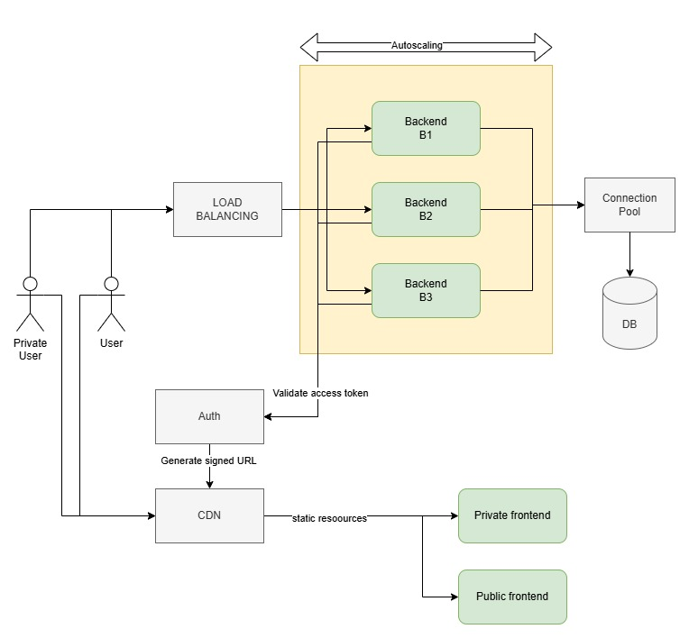

# Architect Practical Test Case

In this test case we will be working under the pretense that you have been hired by a newspaper that wants to set up a website to gain wider audiences, the company is called NewsNow. NewsNow wants to do an MVP of a simple system that will serve news to users, for that they have distinguished the following technical components:
- A frontend that is designed as a static website that will show the content in an appealing and user friendly way.
- A REST API that will work as the backend for the whole system, storing and retrieving data.
 
Another static frontend that will require users to be logged in to add, edit and delete news articles that will be shown via the first App. Despite its early stage, NewsNow foresees that there will be huge traffic spikes since they will be relying heavily on influencers to create content and advertise it.

Assuming that they want to be as reliant as possible on PaaS (Platform as a Service) and that NewsNow has made the corporate decision to work with cloud providers please answer the following:

## Infrastructure
### 1. Please create a diagram of the architecture you would propose to them (we recommend using a tool such as draw.io or similar). In addition, please explain the thought process you have followed to reach this decision.

> For the solution architecture, I propose the following approach:
>
> Public Frontend:
>
> Given that the public-facing website is static, I recommend using a Content Delivery Network (CDN). This will geographically distribute the content to ensure fast download speeds, as resources will be served from locations closer to the users, improving performance. Additionally, it will provide multiple replicas, helping to efficiently manage traffic by balancing the load across different regions, especially during peak traffic times.
>
> Private Website:
>
> For the private website, I suggest adopting the same CDN approach as with the public frontend. Additionally, to offload responsibility from the backend, I recommend integrating an external authentication service. This will allow us to delegate the scalability of the authentication functionality, avoiding the need to manage this logic internally within the backend.
>
> Backend:
>
> The backend will consist of multiple instances with auto-scaling capabilities to handle varying traffic loads. These instances will be distributed via a load balancer to ensure efficient traffic distribution. The backend will leverage the external authentication service to authorize requests as needed, maintaining a secure and scalable system.
>
> This architecture ensures performance, scalability, and security by utilizing modern services like CDNs and external authentication providers, while also maintaining flexibility in handling traffic peaks.

### 2. How would this system be able to handle the massive traffic NewsNow is expecting? What possible pain points do you foresee?
#### Handling Massive Traffic for NewsNow
> **Content Delivery Network (CDN) for Static Frontends**
> Both the public and private frontends are served through a CDN, which will significantly reduce load times and distribute traffic efficiently.
> The CDN ensures that static assets (HTML, CSS, JavaScript, images) are cached and served from edge locations closest to users, reducing the load on the origin servers.
> This approach minimizes the impact of high traffic spikes, as the majority of requests will not reach the backend.
> 
> **Auto-Scaling Backend with Load Balancing**
> The REST API backend is designed with auto-scaling to dynamically adjust the number of instances based on demand. This ensures that during traffic spikes, additional resources are provisioned automatically.
> A load balancer will distribute requests efficiently across backend instances, preventing any single server from being overwhelmed.
> The database layer should also be designed with read replicas or a caching layer (e.g., Redis, Cloudflare Cache, or AWS ElastiCache) to reduce the number of expensive database queries.
> 
> **External Authentication Service**
> Delegating authentication to an external service ensures that the backend does not need to handle user session management, login requests, or security concerns, offloading these responsibilities to a scalable third-party provider.
> This prevents the authentication system from becoming a bottleneck during peak traffic times.
>
> **Asynchronous Processing & Caching**
> To improve response times and reduce backend load, caching mechanisms such as CDN caching, API response caching, and database query caching will be implemented.
> Asynchronous processing (e.g., message queues like AWS SQS, RabbitMQ, or Kafka) can be used for background tasks such as analytics tracking, notifications, and content indexing, preventing API endpoints from slowing down under heavy traffic.

#### Possible Pain Points & Challenges
> **CDN Cache Invalidation**
> While CDNs improve performance, managing cache expiration for dynamic news content can be challenging. If updates to news articles need to be reflected in real time, an effective cache invalidation strategy must be in place to refresh content appropriately.
> 
> **Database Bottlenecks**
> Under heavy traffic, database queries can become a performance bottleneck. Solutions include:
> - Read replicas to distribute query loads.
> - Database sharding if write-heavy operations become a concern.
> - Using caching layers (e.g., Redis or Memcached) to reduce database hits.
> 
> **Authentication Rate Limits & Dependency on Third-Party Providers**
> If many users attempt to log in simultaneously, the external authentication provider may become a bottleneck. It’s crucial to choose a provider that supports rate limiting and auto-scaling. 
> A failover mechanism should be in place in case of authentication service outages.
> 
> **Backend Auto-Scaling Costs & Cold Starts**
> While auto-scaling ensures system availability, cold starts for new instances could introduce latency.
> Using warm pools or pre-warmed instances can help mitigate delays.
> Optimizing backend responses and database queries will also reduce the need for excessive auto-scaling, lowering operational costs.
> 
> **Handling Traffic Surges from Influencers**
> Since NewsNow relies on influencers to drive traffic, sudden surges in user requests could overload the system. To mitigate this:
> - Rate limiting and throttling should be implemented to prevent abuse.
> - Progressive feature rollout techniques can help stagger load increases.
> - Synthetic load testing before launch will help assess infrastructure limits.

## Development
### 3. In order to serve Images to clients on different devices, NewsNow decides to create a simple service that dynamically rescales images to different resolutions. Your task as the lead architect is to make sure the structure is well defined and provide a functional PoC to the team.
In order to accomplish this task, you decide to create a REST API with the following endpoints:
- POST /task – This receives an image and specific dimensions to rescale it, and outputs the image in the desired new dimensions (as an extra, you can store the image somewhere and just return the URL of the resource). In addition, the system will persist the current information associated with the task:
    - Timestamp of when the task was created
    - MD5 of the original file
    - Resolution applied to the image
    - OPTIONAL: URL of the stored image
- GET /task/:taskId
    - This endpoint will return the information associated with the task associated with the corresponding Id.

In order to do the image rescaling you can use a framework like [Thumbnailator](https://github.com/coobird/thumbnailator) for Java or [Sharp](https://github.com/lovell/sharp) for node.js.

> This project is a Java-based application built with Maven and Spring Boot, following a Hexagonal Architecture approach to ensure modularity, maintainability, and separation of concerns. The system is structured into multiple submodules, each serving a distinct role in the architecture:
>
> - boot 
> This module is responsible for the application's initial setup and configuration, including dependency injection, environment settings, and any global configurations needed for the system to run efficiently.
>
> - apirest 
> Contains the REST controllers that expose the application's endpoints.
> Implements DTO-to-entity mapping using MapStruct, ensuring clean and efficient data transformation.
> OpenAPI is used to define and document the REST API endpoints, improving clarity and facilitating API consumption by external clients.
>
> - application
> Houses the business logic implementations for the various use cases of the system.
> Includes helpers and service implementations that orchestrate interactions between the domain and infrastructure layers while ensuring adherence to business rules.
>
> - domain
> Defines the entity classes, encapsulating the core business logic of the system.
> Contains the interfaces for use cases, repository interactions, and third-party services, ensuring decoupling from specific framework implementations.
> Acts as the pure domain layer, maintaining business rules without dependencies on infrastructure or external technologies.
>
> - infrastructure  
> Implements the third-party service integrations, repository persistence mechanisms, and external system interactions.
> This module ensures that external dependencies (databases, APIs, messaging systems, etc.) are abstracted from the business logic, promoting flexibility and easier adaptability to changes in external services.

### 4. To finish the PoC and allow the team to test it, would you be able to deploy it somewhere where it can be tested? Please detail the process.